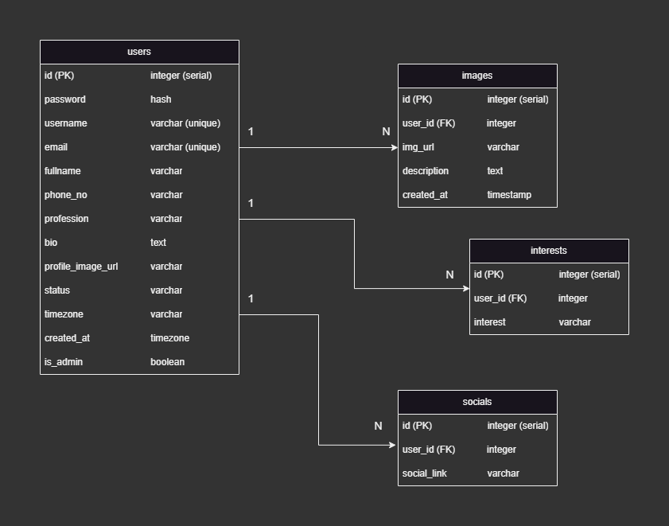

# instalike_server

APIs for an Instagram-like platform where users can showcase their images.

### [API Swagger Documentation](https://instalike.onrender.com/docs/)

## Setup:

- Requires `node >= 18.14.0` and `yarn >= 1.22.19`
- Clone the repository
- `cd` to root directory
- Install the dependencies: `yarn install`
- Start the server: `yarn dev`
- If you get something like the following then everything is in order ✌️

  

### PostgreSQL Setup:

Before running the server setup your postgres database.

- Requires `PostgreSQL >= 15.3`
- Create `.env` in the root directory
- Give your postgres infos in `.env`:

```
PGUSER=<your_postgres_username>
PGHOST=<your_postgres_host>
PGDATABASE=<your_database_name>
PGPASSWORD=<your_postgres_password>
PGPORT=<your_database_port>
```

## DB Schema:



SQL file: [./assets/instalikeDB.sql](./assets/instalikeDB.sql)

## Deployment Flow:


## Completed Features:

| Method | URL                                        | Description                                                   | Login Required |
| ------ | ------------------------------------------ | ------------------------------------------------------------- | -------------- |
| POST   | `/api/user/register`                       | Register new user (with confirmation email)                   | ❌             |
| POST   | `/api/user/login`                          | Sign in user                                                  | ❌             |
| GET    | `/api/user/profile`                        | Get user profile information                                  | ✅             |
| PUT    | `/api/user/update`                         | Update user information                                       | ✅             |
| DELETE | `/api/user/delete`                         | Remove user account (set status to `deactivated`)             | ✅             |
| PATCH  | `/api/user/change_password`                | User can change password                                      | ✅             |
| POST   | `/api/image`                               | Upload image                                                  | ✅             |
| GET    | `/api/image?page={page_num}&limit={limit}` | Get paginated images by offset and limit (for dashboard)      | ❌             |
| GET    | `/api/image/:imgId`                        | Get image details                                             | ❌             |
| DELETE | `/api/image/:imgId`                        | User can delete an image if he/she is the owner of that image | ✅             |
| GET    | `/api/admin`                               | Admin can view all users list                                 | ✅             |
| PATCH  | `/api/admin/:userId`                       | Admin can edit user status                                    | ✅             |

## Issues & Todos:

- Implement forgot password.
- Add actual image as binary instead of URL?
- Cropping and adjusting functionality while uploading image.
